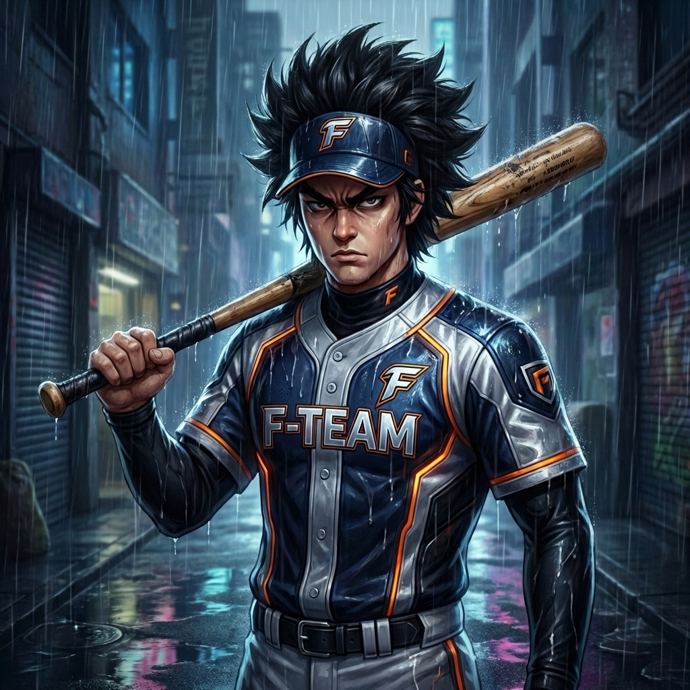
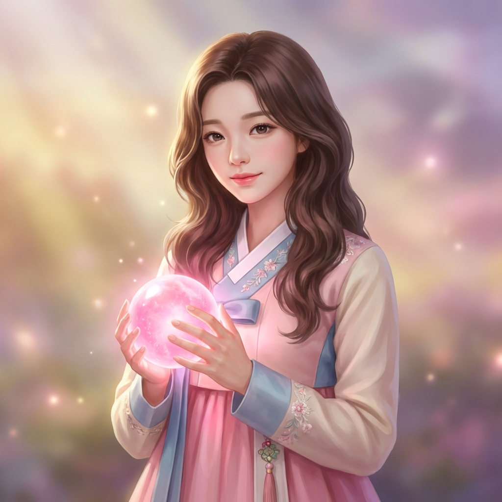
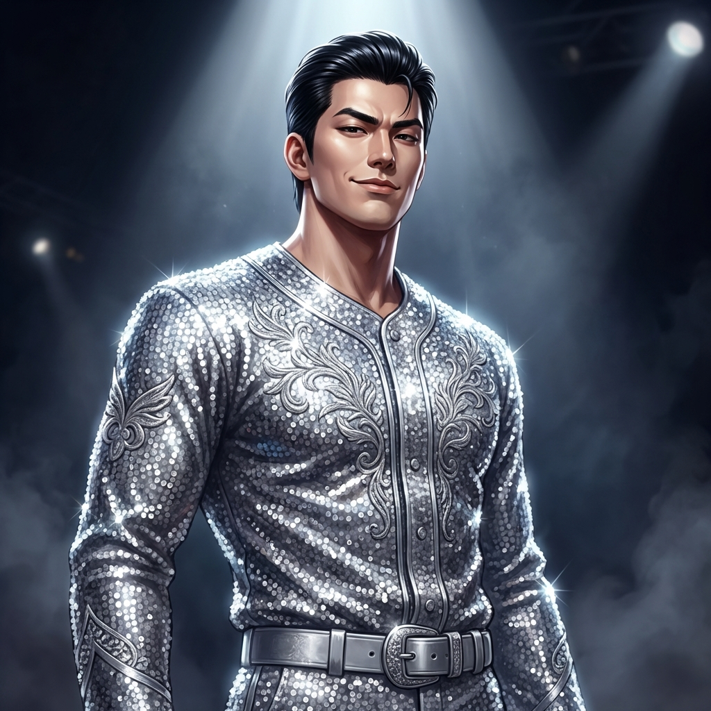
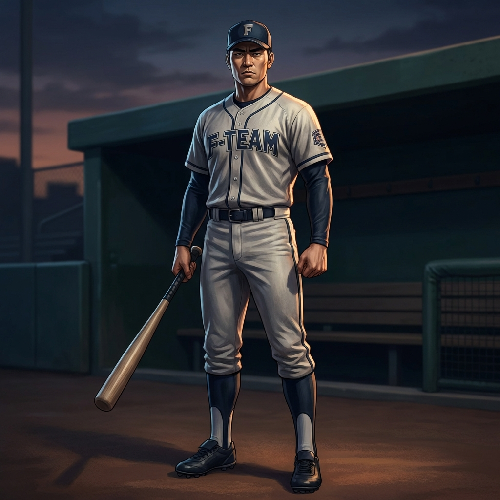

# F-Team 2050 Character Art (2.5D)

I have generated the following characters based on the project style guide and reference images from the `C:\WORK\F-Team2050\image` folder.

## Main Characters

### Oh Hye-sung (Sulkachi)

### Umji (Choi Eom-ji)

## Supporting Characters / Rivals

### Ma Dong-tak

### Baek Du-san

### Ha Guk-sang

### Jo Sang-gu

### Choi Gwan

### Lee Do-ha

